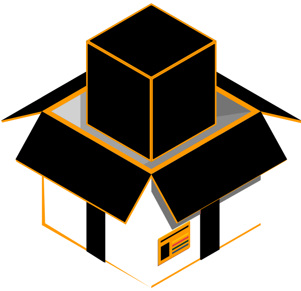

# OpenBits Web Portal

<div align="center">
   
</div>

# TO BE COMPLETED #

## Project setup
```
npm install
```

### Compiles and hot-reloads for development
```
npm run serve
```

### Compiles and minifies for production
```
npm run build
```

### Useful Things to test

OPENBITS-CURRENT-REGISTRY
- address: uo_I4pqYAU7eREXVIrQv0EfnZy4Vb-WH79unqiIw8lA

OPENBITS CBVAC PST: 
- state address:  Y3y5l1N7DnE1DTCyRBZhPQPU7SexhIkxzcu2IfZ37qI
- contract address: 4p7fwtuGc1tdbsDo9ZWalUX4cKgY8xRb6fUaB7JcW8U

SUPERMANISE test CBVAC PST: 
- state address: oF9z_FGY618Ht63scQOas8NHxbqjc6OlT_PoYaVwyhQ

CAPTAINAMERICANISE test CBVAC PST:
- state address: GTT5IdnU0PLY6SBJl_CUWjEq9TNyMbToeJjCZhAq0Jo

### Credits

Section Why image is a derived work of <a href='https://www.freepik.com/free-photos-vectors/business'>Business vector created by freepik - www.freepik.com</a>
Bricks wallpaper courtesy of <a href='https://www.freepik.com/free-photos-vectors/background'>Background vector created by dotstudio - www.freepik.com</a>

Universe <a href='https://www.freepik.com/free-photos-vectors/background'>Background vector created by upklyak - www.freepik.com</a>

LOGO TWO <a href='https://www.freepik.com/free-photos-vectors/label'>Label vector created by freepik - www.freepik.com</a>
LOGO THREE <a href='https://www.freepik.com/free-photos-vectors/abstract'>Abstract vector created by freepik - www.freepik.com</a>
LOGO FOUR <a href='https://www.freepik.com/free-photos-vectors/background'>Background vector created by GarryKillian - www.freepik.com</a>

ISO DEV <a href="https://www.vecteezy.com/free-vector/isometric-development">Isometric Development Vectors by Vecteezy</a>
