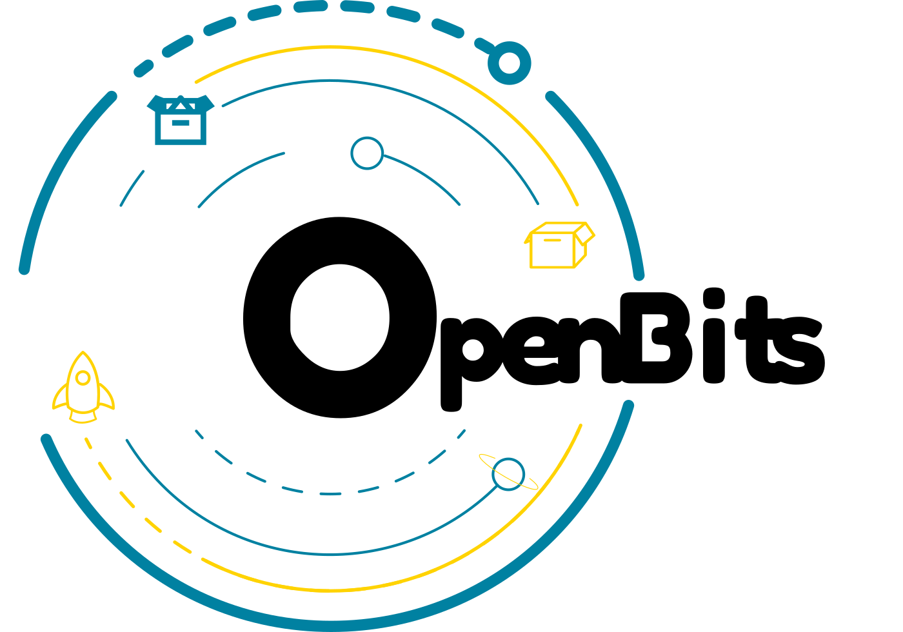

# OpenBits Web Application

<div align="center">
   
</div>

This is the source code of the Web Application of OpenBits. The web application is a Vue.JS application and it includes both the landing page (the web site) and the actual application that allows to publish and invest in OpenBits. The following sections explain how to setup your own development environment to contribute to OpenBits or to run a fork of it. 

## Project setup

Firstly, clone this project by running: 

```
git clone https://gitlab.com/cervoneluca/openbits-web.git
```

Then install the needed node packages by running: 

```
npm install
```

Now, if you want to test the application by using the registry and contracts that are currently in production, then just run:

```
npm run serve
```

By doing so, you will use the following environment: 

**OPENBITS-OWNER:**
- wallet address: XKVU3cnfIXOSQkAAiTse7C2_xnzBkVxeKQ3oXGqAt_4

**OPENBITS-CURRENT-REGISTRY:**
- state address: S3a-4VByScX0vtjmh5oZPs8kHTNn-8UPFVOkm2RprDc

**OPENBITS PST:** 
- state address:  dpRwKqXGO234CgHp5i_zr0Vv-caoej-EWd9cpQVcYhA
- contract address: ktzyKTMpH-HsLc8fuLcG2jzVO9V6mCFl4WC5lPWLRD8

If you do not want to use the above environment, you have to set up your development one, as described in the next section.

## Setup a customized development environment

Firstly you have to publish your customized SmartWeave contract that handles the OpenBits' registry. 

To do so, go in a different folder from the OpenBits root and [Clone SmartWeave](https://github.com/ArweaveTeam/SmartWeave) by doing the following:

```
git clone https://github.com/ArweaveTeam/SmartWeave
```

then, go in the folder where you have cloned SmartWeave and run: 

```
npm install
```

After all packages are installed, you can publish your customized OpenBits registry. Go in the folder where you have cloned SmartWeave and run: 

```
node smartweave-cli --key-file path-to-your-arweave-wallet-file --create --contract-src <path-to-openbits-web>/src/contracts/openbits-registry.js --init-state <path-to-openbits-web>/src/contracts/openbits-registry.json 
```
The command should return an arweave transaction id. Await that the arweave transaction is confirmed (you need the [arweave-deploy cli to do that](https://github.com/ArweaveTeam/arweave-deploy)) and then update file in <openbits-web-path>/src/configs/configs.js, whit the following

```javascript
// file <openbits-web-path>/src/configs/configs.js

const configs = () => {
  const config = {
    OPENBITS_ARWEAVE_ADDRESS: 'your-arweave-wallet-address',
    OPENBITS_REGISTRY: 'the-openbits-registry-address',
    OPENBITS_CBVAC_PST: '',
    OPENBITS_CBVAC_STATUS: '',
    FEE_FOR_INSTALLATION: 0.01,
    FEE_FOR_PUBLICATION: 0.0001,
  };
  return config;
};

export default configs;

```

Having done that, you have to publish the PST contract. This will serve both to monitor the status of the whole OpenBits and as the contract source for PSTs that will be created for each OpenBit (package) that users publish. To do so, go in the folder where you have cloned SmartWeave and run: 

```
node smartweave-cli --key-file path-to-your-arweave-wallet-file --create --contract-src <path-to-openbits-web>/src/contracts/cbvac-pst.js --init-state <path-to-openbits-web>/src/contracts/openbits-cbvac-pst-init-state.json
```

The command should return an arweave transaction id. Await that the arweave transaction is confirmed (you need the [arweave-deploy cli to do that](https://github.com/ArweaveTeam/arweave-deploy)) and then update file in <openbits-web-path>/src/configs/configs.js, whit the following:

```javascript
// file <openbits-web-path>/src/configs/configs.js

const configs = () => {
  const config = {
    OPENBITS_ARWEAVE_ADDRESS: 'your-arweave-wallet-address',
    OPENBITS_REGISTRY: 'the-openbits-registry-address',
    OPENBITS_CBVAC_PST: '',
    OPENBITS_CBVAC_STATUS: 'the-openbits-pst-state-address',
    FEE_FOR_INSTALLATION: 0.01,
    FEE_FOR_PUBLICATION: 0.0001,
  };
  return config;
};

export default configs;

```

Now you have to find the transaction id of the source PST that you have published. To do so await that the above transaction is confirmed and the go to the [arweave block explorer]. In the search tab in the right top corner, insert the address of the wallet you are used to publish PST as described before and find the transaction of the source PST you have published. Then update  <openbits-web-path>/src/configs/configs.js, as the following:

```javascript
// file <openbits-web-path>/src/configs/configs.js

const configs = () => {
  const config = {
    OPENBITS_ARWEAVE_ADDRESS: 'your-arweave-wallet-address',
    OPENBITS_REGISTRY: 'the-openbits-registry-address',
    OPENBITS_CBVAC_PST: 'the-openbits-pst-source-address',
    OPENBITS_CBVAC_STATUS: 'the-openbits-pst-state-address',
    FEE_FOR_INSTALLATION: 0.01,
    FEE_FOR_PUBLICATION: 0.0001,
  };
  return config;
};

export default configs;

```

Now you are ready to go! To run a live version run: 

```
npm run serve
```

And then navigate with your browser to [http://localhost:8080](http://localhost:8080) (port may change, checkout the log when you started the vue app). 

Pay attention, starting the application may give a warning like this

```
 WARNING  Compiled with 2 warnings                                                                                                                                                          warning  in ./node_modules/sentencer/node_modules/natural/lib/natural/wordnet/wordnet.js
Module not found: Error: Can't resolve 'WNdb' in '/Users/lucacervone/Downloads/openbits/openbits-web/node_modules/sentencer/node_modules/natural/lib/natural/wordnet'
warning  in ./node_modules/sylvester/lib/node-sylvester/matrix.js
Module not found: Error: Can't resolve 'lapack' in '/Users/lucacervone/Downloads/openbits/openbits-web/node_modules/sylvester/lib/node-sylvester'

```

Do not take care of it, it is only a non-blocking warning. 

The next section explain how to create a production ready building

### Compiles and minifies for production

To create a production ready building you have to run the following: 

```
npm run build
```

Having done that, your build will be in the Dist folder. 

You have several way to deploy it, as followings: 

- deploy on the arweave by running: 
```
arweave deploy-dir dist
```

- deploy on the IPFS by running: 
```
ipfs add -r dist
```

- deploy on your web server. Remember that the application must be served by means of HTTPS, otherwise it will not work! 

That's all! 

### Credits

- Section Why image is a derived work of <a href='https://www.freepik.com/free-photos-vectors/business'>Business vector created by freepik - www.freepik.com</a>
- The Universe Image in the hero background is a courtesy of <a href='https://www.freepik.com/free-photos-vectors/background'>Background vector created by upklyak www.freepik.com</a>
